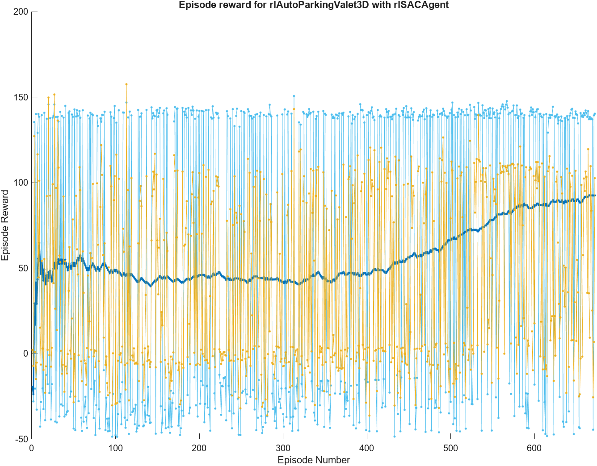
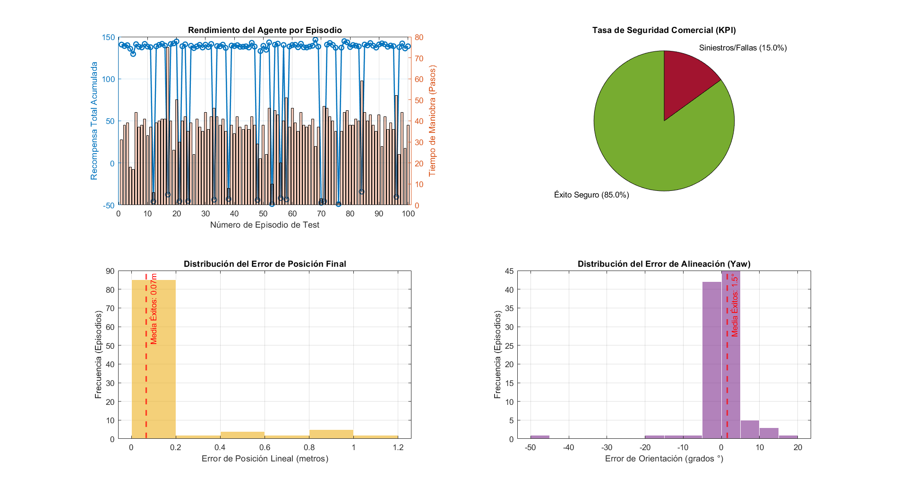
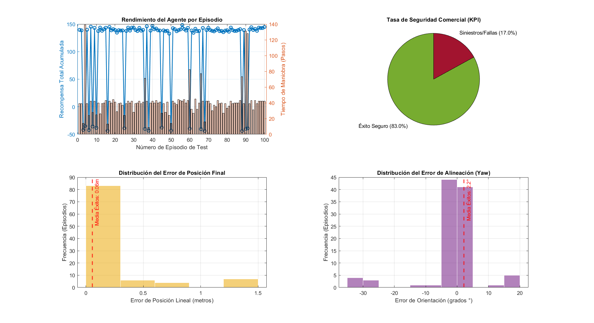
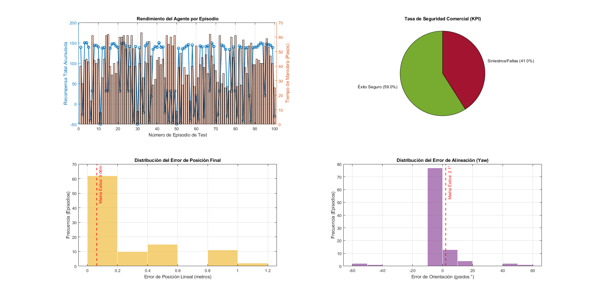

<div align="center">

<br/>

<!-- HERO BANNER -->


<br/><br/>

# 🚗 Autonomous Parking Valet
### Hybrid Control · Adaptive MPC + Deep Reinforcement Learning · Unreal Engine® Digital Twin

<br/>

[](https://www.mathworks.com/products/matlab.html)
[](https://www.mathworks.com/products/simulink.html)
[](https://www.unrealengine.com/)
[](LICENSE)
[](https://github.com/FerXxk/Auto-Parking-RL)

<br/>

> *A production-grade digital twin that fuses classical optimal control with modern deep RL — the vehicle searches, decides, and parks itself, entirely autonomously.*

<br/>

---

</div>

## 📌 Table of Contents

- [Overview](#-overview)
- [How it works](#-how-it-works)
- [Architecture](#-architecture)
- [Sensor stack](#-sensor-stack)
- [MPC controller](#-adaptive-mpc-controller)
- [DRL agent](#-deep-reinforcement-learning-agent)
- [Reward design](#-reward-function-design)
- [Supported algorithms](#-supported-rl-algorithms)
- [Environment & parking lot](#-environment--parking-lot)
- [Quick start](#-quick-start)
- [Training from scratch](#-training-from-scratch)
- [Results](#-results)
- [File structure](#-file-structure)
- [Requirements](#-requirements)
- [References](#-references)

---

## 🎯 Overview

This project implements a **hybrid autonomous parking system** capable of navigating a photorealistic parking lot, finding a free spot, and executing a precise parking maneuver — all without human intervention.

The core innovation is a **seamless handoff** between two complementary control paradigms:

| Phase | Controller | Task |
|-------|-----------|------|
| 🔍 **Search** | Adaptive MPC | Follow reference path at constant speed, scan for free spots |
| 🅿️ **Park** | DRL Agent (DDPG / TD3 / SAC) | Execute collision-free parking maneuver using Lidar feedback |

The entire system runs as a **digital twin** inside Unreal Engine®, co-simulated with MATLAB/Simulink — providing photorealistic sensor data and vehicle dynamics with zero real-world risk.

<br/>

<div align="center">

<br/><sub>2D parking lot map — green = free, red = occupied. The dashed pink line is the MPC reference path.</sub>
</div>

<br/>

---

## ⚙️ How It Works

The system operates in two distinct phases, triggered by a central **mode switch** signal (`isParking`):

```
┌─────────────────────────────────────────────────────────────────┐
│                        HYBRID CONTROLLER                        │
│                                                                 │
│  ┌──────────────────┐   spot found?   ┌─────────────────────┐  │
│  │   Adaptive MPC   │ ──────────────► │    DRL Agent        │  │
│  │  (search mode)   │                 │  (parking mode)     │  │
│  │                  │                 │  DDPG / TD3 / SAC   │  │
│  └──────────────────┘                 └─────────────────────┘  │
│           ▲                                     ▲               │
│           │          Vehicle Mode Selector      │               │
│           └──────────── isParking ──────────────┘               │
└─────────────────────────────────────────────────────────────────┘
```

1. **Initialization** — the vehicle spawns at the southeast corner of the lot; the global path planner generates the reference trajectory.
2. **Search phase** — the Adaptive MPC tracks the reference path while the virtual camera and Lidar modules scan each parking row.
3. **Mode switch** — the `Vehicle Mode Selector` detects an empty spot and flips `isParking = true`, activating the RL agent subsystem and freezing the MPC.
4. **Parking phase** — the DRL agent reads the 3D Lidar point cloud and the relative pose error `[Δx, Δy, Δθ]`, then outputs a continuous steering angle and velocity command to slot the vehicle in.
5. **Done** — the episode ends when the vehicle is within tolerance of the target pose or a collision/timeout is detected.

---

## 🏗️ Architecture

```
rlAutoParkingValet3D.slx
│
├── Vehicle Dynamics                  ← Bicycle kinematic model (Ts = 0.1 s)
│
├── MPC Tracking Controller           ← Adaptive MPC (search mode)
│   ├── Lateral error minimisation
│   └── Speed regulation
│
├── RL Controller                     ← DRL agent (parking mode)
│   ├── Actor network  (continuous actions: δ, v)
│   └── Critic network (Q-value estimation)
│
├── Vehicle Mode Selector             ← isParking signal logic
│
└── Unreal Engine Visualization &     ← 3D render + sensor simulation
    Sensing Subsystem
    ├── Simulation 3D Lidar (360° FOV, 40° vertical)
    └── Camera occupancy algorithm
```

The `RL_Parking_And_Control.m` script is the **single entry point** — it wires together the environment, agents, and training options before opening the Simulink model.

---

## 📡 Sensor Stack

<div align="center">

<br/><sub>Unreal Engine® renders a photorealistic environment; the roof-mounted Lidar generates a dense 3D point cloud in real time.</sub>
</div>

<br/>

| Sensor | Spec | Role |
|--------|------|------|
| **3D Lidar** | 360° H-FOV · 40° V-FOV · roof-mounted | Obstacle detection + point cloud observations for RL |
| **Virtual camera** | Parking-row scan algorithm | Spot occupancy detection (green/red indicator) |
| **Ego pose** | Ground-truth from Simulink | Relative pose error `[Δx, Δy, Δθ]` fed to both controllers |

---

## 🧭 Adaptive MPC Controller

The MPC controller tracks the global reference trajectory by solving a **constrained finite-horizon optimisation** at every timestep `Ts = 0.1 s`.

**State vector:**
```
x = [X, Y, θ, v]   (position, heading, speed)
```

**Control inputs:**
```
u = [δ, a]   (steering angle, acceleration)
```

**Objective:**
```
min  Σ [ (y - y_ref)ᵀ Q (y - y_ref) + uᵀ R u ]
```

The *adaptive* part means the internal prediction model updates its linearisation at each step to match the current vehicle speed — crucial for maintaining accuracy at varying velocities without full nonlinear MPC overhead.

**Constraints enforced:**
- Steering angle: `|δ| ≤ 0.5 rad`
- Speed: `0 ≤ v ≤ 5 m/s`
- Steering rate: `|Δδ| ≤ 0.1 rad/step`

---

## 🧠 Deep Reinforcement Learning Agent

Once a free spot is found, the DRL agent takes full authority over the vehicle.

### Observation space

| Signal | Dimension | Description |
|--------|-----------|-------------|
| Lidar point cloud (processed) | 1 × N | Distances to nearby obstacles |
| Relative pose error | 1 × 3 | `[Δx, Δy, Δθ]` to target spot |

### Action space

| Action | Range | Description |
|--------|-------|-------------|
| Steering angle δ | `[-0.5, 0.5]` rad | Continuous, normalised |
| Longitudinal velocity v | `[-2, 2]` m/s | Allows forward and reverse |

### Network architecture

```
Actor:  observations → FC(256) → ReLU → FC(128) → ReLU → tanh → actions
Critic: [obs, act]   → FC(256) → ReLU → FC(128) → ReLU →       → Q-value
```

---

## 🏆 Reward Function Design

The shaped reward guides the agent towards clean, efficient parking:

```matlab
% Proximity reward (dense guidance)
r_pose  = -w1 * norm([Δx, Δy]) - w2 * abs(Δθ);

% Success bonus
r_done  = +100  (if within tolerance: Δpos < 0.3 m, Δθ < 0.1 rad);

% Collision penalty
r_coll  = -50   (if Lidar detects obstacle within safety radius);

% Time penalty (encourages speed)
r_time  = -0.1  (per timestep);

% Total
R = r_pose + r_done + r_coll + r_time;
```

---

## 🤖 Supported RL Algorithms

The project supports three off-policy actor-critic algorithms. Switch between them via the `agentType` variable in `RL_Parking_And_Control.m`:

| Algorithm | Key strength | Best for |
|-----------|-------------|----------|
| **DDPG** | Simple, fast convergence | Baseline, quick experiments |
| **TD3** | Overestimation fix, more stable | Default recommended |
| **SAC** | Entropy regularisation, robust exploration | Challenging spots, narrow spaces |

```matlab
agentType = "TD3";   % options: "DDPG" | "TD3" | "SAC"
```

---

## 🅿️ Environment & Parking Lot

The simulation uses a subsection of the MathWorks **Large Parking Lot** scene rendered in Unreal Engine®:

- **20+ numbered parking spots** — each with a green/red occupancy indicator
- **Static obstacle vehicles** fill all occupied spots as rigid bodies
- **Reference path** starts at the southeast corner, sweeps the lot west-to-east

```matlab
% Set which spot is free (all others filled with static vehicles)
freeSpotIndex = 18;
setupActorVehicles("rlAutoParkingValet3D", freeSpotIndex);
```

You can test any of the 20+ spots by changing `freeSpotIndex` and updating `egoTargetPose` accordingly.

---

## 🚀 Quick Start

### 1 — Clone

```bash
git clone https://github.com/FerXxk/Auto-Parking-RL.git
cd Auto-Parking-RL
```

### 2 — Open in MATLAB

Set the repo root as your MATLAB working directory, then open the entry-point script:

```matlab
open('RL_Parking_And_Control.m')
```

### 3 — Run a pre-trained simulation

```matlab
% Use pre-trained weights — no training required
doTraining = false;
```

Click **Run** in Simulink (`rlAutoParkingValet3D.slx`). The Unreal Engine 3D viewport will open and the vehicle will search, switch modes, and park autonomously.

### 4 — Try different spots

```matlab
% List the parking spots you want to simulate (valid indices: 1 to 23)
spotsToSimulate = [20, 6, 17, 1, 12]; 
```

---

## 🏋️ Training From Scratch

To train a new agent from random initialisation:

```matlab
doTraining = true;
agentType   = "TD3";      % "DDPG" | "TD3" | "SAC"
```

Training options are configured inside `RL_Parking_And_Control.m` via `rlTrainingOptions`. Expect **several hours** on a modern GPU with Parallel Computing Toolbox enabled.

**Monitor training progress** in the Episode Manager window — watch cumulative reward climb and episode length shrink as the agent learns to park efficiently.


<div align="center">
  
  <br/><sub>SAC training curve — cumulative reward per episode</sub>
</div>

---

## 📊 Results

<div align="center"  style="margin-bottom: 40px;">
  
  <br/><sub>Results from 100 episodes simulation with SAC agent</sub>
</div>


<div align="center"   style="margin-bottom: 40px;">
  
  <br/><sub>Results from 100 episodes simulation with TD3 agent</sub>
</div>


<div align="center">
  
  <br/><sub>Results from 100 episodes simulation with DDPG agent</sub>
</div>

---

## 📁 File Structure

```
Auto-Parking-RL/
│
├── RL_Parking_And_Control.m              ← Main entry point script
├── rlAutoParkingValet3D.slx              ← Core Simulink model
│
├── AutomaticParkingValetWithUnreal
│   EngineSimulationExample/
│   ├── ParkingLotManager.m               ← Environment state manager
│   ├── ParkingLotVisualizer.m            ← 2D visualisation utility
│   ├── setupActorVehicles.m              ← Populate lot with static vehicles
│   ├── createReferenceTrajectory.m       ← Global path generator
│   └── *.m / *.mat                       ← Agent networks, helper functions
│
├── images/                               ← Figures and screenshots
├── videos/                               ← Simulation recordings
└── .gitignore
```

---

## 🛠️ Requirements

### MATLAB Toolboxes

| Toolbox | Version |
|---------|---------|
| MATLAB | R2023b or newer |
| Simulink | included with MATLAB |
| Reinforcement Learning Toolbox | required |
| Model Predictive Control Toolbox | required |
| Automated Driving Toolbox | required |
| Robotics System Toolbox | required |
| Parallel Computing Toolbox | recommended (training) |

### System

- **OS:** Windows 10/11 (Unreal Engine co-simulation requires Windows)
- **RAM:** 16 GB minimum, 32 GB recommended
- **GPU:** CUDA-capable GPU recommended for training
- **Unreal Engine:** Installed via MathWorks Automated Driving Toolbox support package

---

## 📚 References

- MathWorks. *Automatic Parking Valet with Unreal Engine Simulation* — [docs.mathworks.com](https://www.mathworks.com/help/reinforcement-learning/ug/automatic-parking-valet-with-mpc-and-unreal-engine.html)
- Fujimoto, S. et al. *Addressing Function Approximation Error in Actor-Critic Methods (TD3)*, ICML 2018
- Haarnoja, T. et al. *Soft Actor-Critic: Off-Policy Maximum Entropy Deep Reinforcement Learning*, ICML 2018
- Lillicrap, T. et al. *Continuous Control with Deep Reinforcement Learning (DDPG)*, ICLR 2016
- Zhang, Z. et al. *Automated Parking Trajectory Generation Using Deep Reinforcement Learning (SAC)*, arXiv 2025

---

<div align="center">

<br/>

Made by  · [Fernando Román](https://github.com/FerXxk) ·  [Jose Antonio García](https://github.com/FerXxk) · [Andrés Martínez](https://github.com/FerXxk)

<br/>

[](https://github.com/FerXxk/Auto-Parking-RL)

</div>